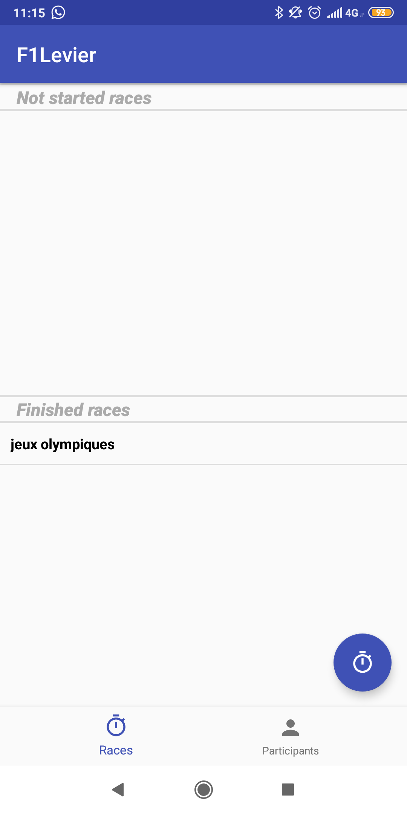
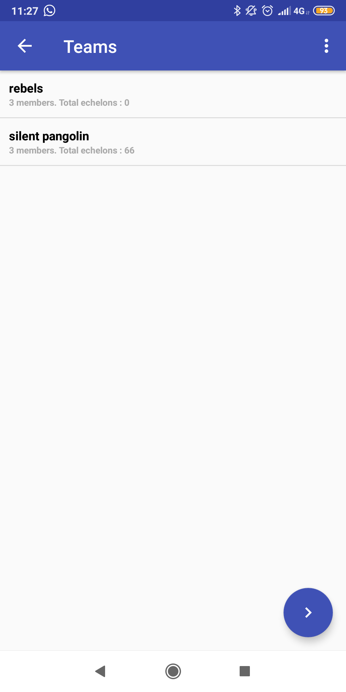
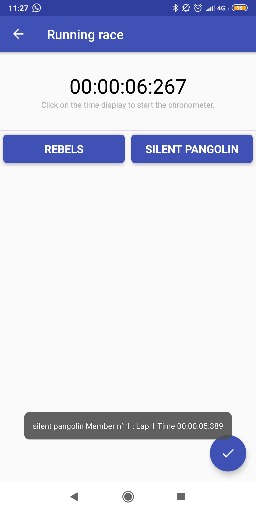
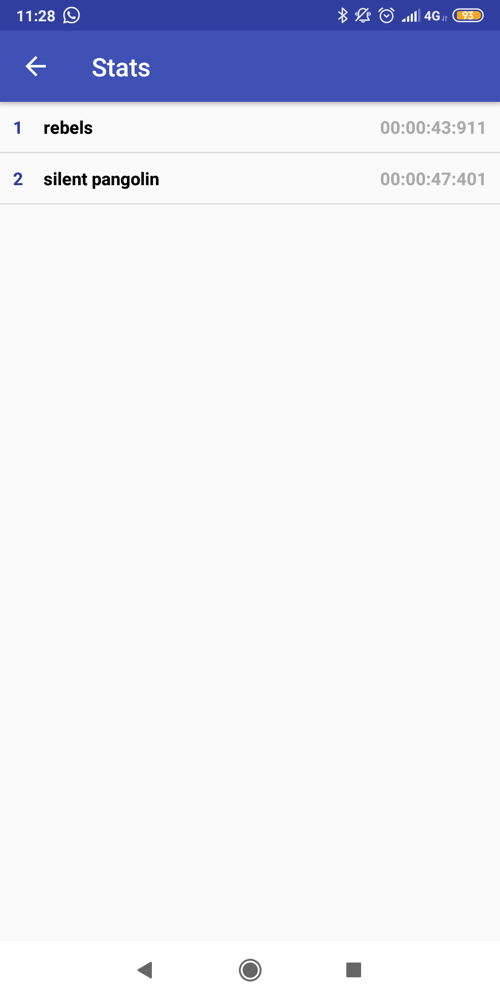

# F1Levier

A project which has been given us to experiment Android programming

* Stores participants for race
* Loads participants list from file
* Creates teams for races
* Displays a chronometer to save times
* Displays ranking stats

### Screenshots

   
